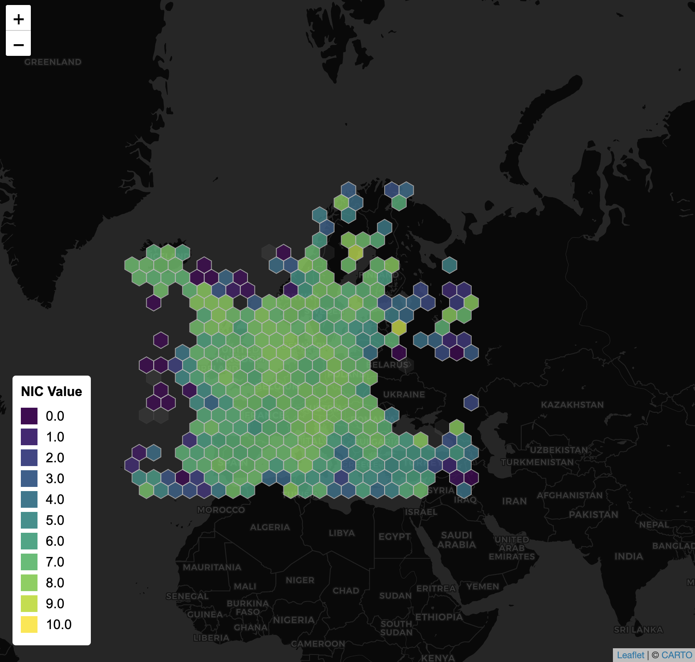
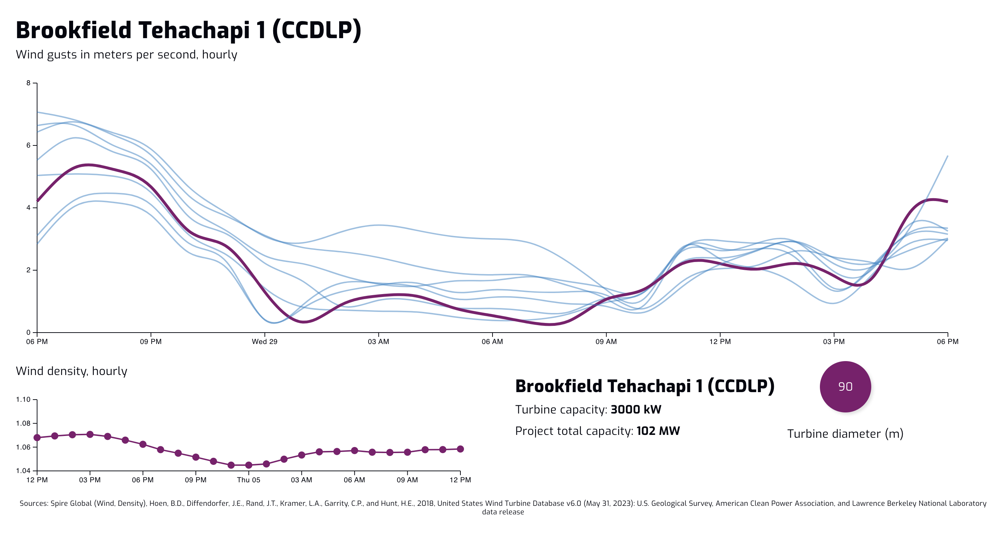
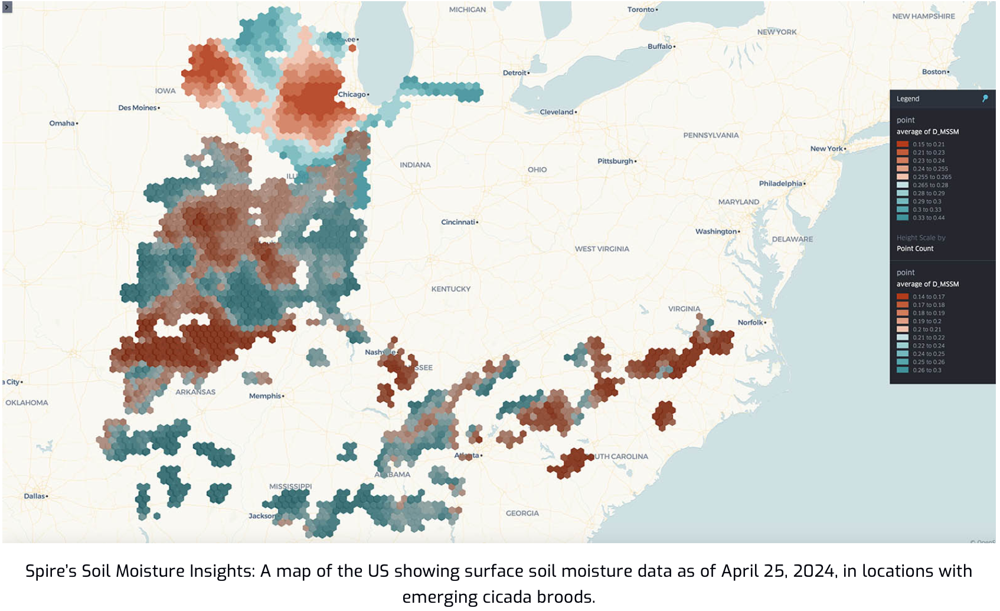
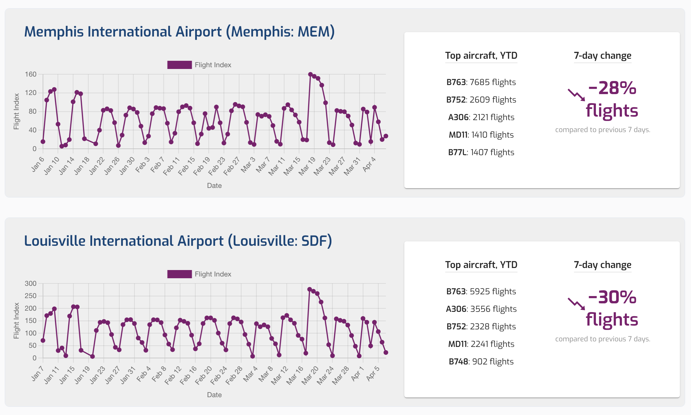

# Spire Data Demos for Journalists

Welcome! This repo is part of a live data show-and-tell for journalists. 

It highlights a few compelling use cases for satellite-derived data from Spire Global, including weather, aviation, and agricultural insights.

> In addition to the files in this repo, hi-res (~100m) Weather and Soil Moisture demo data is available here (Note: files are large!): https://drive.google.com/drive/folders/1aRmoMjUaZwInAZ6418nsNJq13uXPxG_U

---

## 🌍 Overview

These examples showcase how satellite data can be used in real-world journalism and analysis, from detecting GPS jamming in aviation, to predicting the emergence of billions of cicadas based on soil moisture data.

We’ve included links to:
- 🛰️ Live and interactive visual demos
- 📊 Raw data (CSV / GRIB2)
- 🧪 Notebooks and blog posts for deeper exploration

---

## ✈️ Aviation Data: GPS Jamming Detection

Spire uses satellite-captured ADS-B signals to monitor anomalies in aircraft position reporting, helping detect GPS spoofing or jamming activity around the world.

**🔗 Interactive Demo**  
[GPS Jamming Map (CodePen)](https://codepen.io/andjames/pen/YzoEPyP?editors=0011)  
> Uses real-world spoofing and jamming signal data from ADS-B broadcasts.  
_Data is embedded in the CodePen (CSV format)._

**📝 Background Blog Post**  
[Unclouding Aviation Security: The Growing Threat of GPS Spoofing](https://spire.com/blog/aviation/unclouding-aviation-security-the-growing-threat-of-gps-spoofing/)

---

## 💨 Wind, Renewables & Climate Change

Spire’s weather and climate data helps analysts and energy producers better understand wind patterns and variability — both today and decades into the future. This is critical for planning renewable power generation and adapting to long-term climate shifts.

**📝 Related Blog Post**  
[Wind & Climate Change: Forecasting for the Future](https://insights.spire.com/wind-climate-change-for-the-future)

> Covers long-term trends in wind speed and power density, with implications for renewable energy strategy and resilience.

---

## 🌾 Soil Moisture & Cicada Forecasting

Spire’s weather models (powered by satellite GNSS radio occultation) provide detailed soil data, useful for everything from agriculture to unusual forecasts like insect emergence.

**🧬 Included GRIB2 Data**
- Soil moisture (low resolution)
- Soil temperature
- Latent and sensible heat
- 2m specific humidity
- Volumetric soil moisture

> These are from a weather model run over Europe. A sample agricultural GRIB2 file is included in this repo.

**📝 Related Blog Post**  
[How to Use Soil Moisture and Temperature to Forecast Cicadas](https://spire.com/blog/weather-climate/agriculture-insights-ahead-of-us-cicada-invasion/)

---

## 📦 Aviation Cargo Index (In Development)

Spire is developing a dashboard to highlight aviation cargo trends and insights, derived from satellite ADS-B and other datasets.

**🚧 Demo Dashboard (Beta)**  
[Aviation Cargo Index Dashboard](https://spiredata.wpenginepowered.com)  
> Currently in development; feedback welcome!

This dashboard will soon include additional weather and climate data. If you’re interested in early access or want to stay in the loop, let us know.

---

## 📂 Files in This Repo

| File/Folder | Description |
|-------------|-------------|
| `sof-d.20250405.t00z.0p125.agricultural.europe.f000.grib2` | GRIB2 files for weather and soil conditions in Europe |
| `europe-soil-moisture-data.csv` | Basic CSV of lo-res soil conditions in Europe |
| `sample_aviation-w-nic-and-nacp.json` | Raw JSON file of Spire Aviation data with NACP & NIC values for GPS Jamming |
| `inspect_grib.py` | Python file for inspecting/listing variables in GRIB2 files |
| `extract_grib.py` | Python file for a basic data extraction from GRIB2 files to CSV |
| `README.md` | You're here! |

---

## 🛠️ Ideas for Exploration

- Use Python to parse GRIB2 weather files with `cfgrib` or `xarray`
- Map GPS jamming activity geographically (lots going on around the Baltic Sea).
- Inspect soil moisture values in the Khumbu Region of Nepal during Everest Climbing season
- Soil Moisture and the effectiveness of carbon capture/sequestration programs
- Tariffs and cargo flight variations
- Compare soil temperature and moisture across time for storytelling potential

---

## 🙌 Thanks for Stopping By

We hope this sparks ideas for your own work with satellite data. Feel free to ask questions, or share feedback.

Questions? Contact [@andjames](https://github.com/andjames) or reach out via [andrew.james@spire.com](mailto:andrew.james@spire.com).

